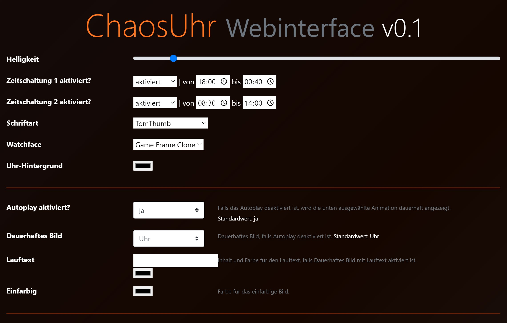
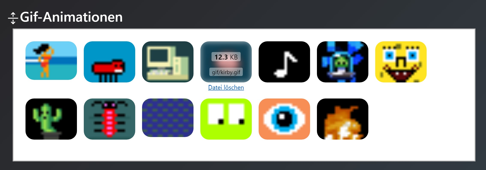

# ChaosUhr - Webinterface Version
https://www.thingiverse.com/thing:4152063 

Ursprünglicher Sketch von Micha1986 (https://github.com/oOmicha1986Oo/ChaosUhr)
Erweitert von Jonas Krug

### Feature-Übersicht

  - Webinterface zur Steuerung und Konfiguration der Uhr
  - Gif-Animations Player: beliebige Gif-Animationen können abgespielt werden
  - Wetteranzeige mit Daten von weatherbit.io
  - Zeitschaltung der Uhr
  
 
 

### FAQ

* __Wie funktioniert die Wetteranzeige?__
Du benötigst einen kostenlosen Account bei weatherbit.io. Auf der Website lässt sich dann ein API-Key generieren, den du in den Sketch einträgst.

* __Wo gebe ich die Wlan-Daten ein?__
Der Sketch verwendet die WifiManager-Library. Dies bedeutet, dass der ESP automatisch einen offenen Wlan-Hotspot öffnet. (Standardmäßig mit dem Namen "ChaosUhr") Sobald du dich mit dem Wlan verbindest kannst du dort deine Wlan-Daten eingeben. Falls du eine falsche Eingabe gemacht hast, oder das Wlan nicht mehr verfügbar ist, öffnet der ESP automatisch wieder den offenen Wlan-Hotspot, ansonsten verbindet er sich mit den von dir eingegebenen Wlan-Daten.

* __Funktioniert die Uhr auch ohne Wlan?__
Leider nein. Der Arduino nutzt einen NTP-Server, um sich die aktuelle Zeit zu holen. Ohne Internet weiß der ESP leider nicht wie viel Uhr es ist..

* __Wie finde ich die Uhr in meinem Netzwerk?__
Um die IP-Adresse der Uhr herauszufinden, kannst du entweder in das Webinterface deines Routers schauen, oder du nutzt einen Ip-Scanner um alle Geräte in deinem Netzwerk zu finden.

* __Wie update ich die Firmware?__
Der Sketch lässt sich über das Webinterface updaten. Sollte allerdings das Webinterface selbst ein Update erhalten, so musst du es über den `ESP8266 Sketch Data Upload` (siehe Installation Punkt 5) updaten.
Neue Gif-Animationen lassen sich ebenfalls einfach über das Webinterface hochladen.

* __Wieso gibt es so wenige Gif-Animationen im Repository?__
Aus urheberrechtlichen Gründen können die meisten Gif-Animationen nicht auf Github geteilt werden. Frage im Discord nach, oder suche selbst nach 16x16-Gif Animationen. (Google: "8bit gif animation")

## Installation

Zum flashen des Wemos D1 (oder einem ähnlichen Gerät) wird die [Arduino IDE](https://www.arduino.cc/en/main/software) benötigt.
Um das Webinterface und die Gif-Animationen auf den Wemos zu spielen wird außerdem das Arduino IDE Plugin ESP8266fs benötigt: (https://github.com/esp8266/arduino-esp8266fs-plugin) - Bitte Anweisungen zur Installation genau folgen.

##### Erstinstallationsschritte:
1. Kopiere den Sketch in deinen Sketchfolder (unter Windows: `C:\Users\ [Benutzer] \Documents\Arduino`)
2. Passe die Einstellungen in der Config.h nach deinen Wünschen an (hier lässt sich die WetterAPI eintragen, sowie die Anzahl Pixel und die Amperezahl deines Netzteils)
3. Installiere fehlende Libraries über den Arduino-Library-Manager nach:
* [FastLED](https://github.com/FastLED/FastLED)
* [FastLED_NeoMatrix](https://github.com/marcmerlin/FastLED_NeoMatrix)
* [WiFiManager](https://github.com/tzapu/WiFiManager)
* [ArduinoJson](https://github.com/bblanchon/ArduinoJson)
* Zudem muss das ESP8266 Board hinzugefügt werden. ([Anleitung](https://randomnerdtutorials.com/how-to-install-esp8266-board-arduino-ide/))
4. Kompiliere und lade den Sketch auf den Wemos in der Arduino IDE über `Sketch-->Hochladen`
5. Lade über `Werkzeuge-->ESP8266 Sketch Data Upload` die Gif-Animationen, sowie das Webinterface hoch.
6. Fertig. Der Wemos kann nun mit deiner Uhr verbunden werden, die restlichen Einstellungen lassen sich über das Webinterface vornehmen.

